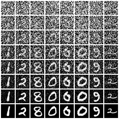

# Image Generation with Diffusion Models


<p align="center">
  
  <br>
  <em>Fig 1. Generated MNIST digits using the implemented Diffusion Model (FID ~3.2).</em>
</p>

This repository contains a complete, high-performance solution for **CVPDL Homework #3: Image Generation**. The project implements a **Denoising Diffusion Probabilistic Model (DDPM)** from scratch to generate high-quality MNIST handwritten digits.

Strictly adhering to the "no pre-trained weights" constraint, this system achieves an **FID score of ~3.2** (significantly better than the full-score threshold of 30). It features a custom U-Net architecture, advanced noise scheduling, and robust training strategies to ensure stability and diversity.


## Key Features

*   **From-Scratch Implementation:** A complete implementation of DDPM and DDIM algorithms without relying on any external diffusion libraries or pre-trained weights.
*   **Cosine Beta Schedule:** Implements the cosine noise schedule (Nichol & Dhariwal, 2021) instead of the standard linear schedule. This preserves information longer for small images (28x28), resulting in sharper digits and lower FID scores.
*   **Exponential Moving Average (EMA):** Maintains a "shadow" model with smoothed weights during training. Using EMA weights for inference significantly improves visual quality and stabilizes the training process.
*   **Custom U-Net Architecture:** Features a carefully tuned U-Net with Time Embeddings, Residual Blocks, and Self-Attention mechanisms at lower resolutions to capture global context.
*   **DDIM Sampling Support:** Supports both standard DDPM (Ancestral Sampling) and DDIM (Deterministic/Accelerated) sampling. DDIM allows for generating high-quality images in fewer steps (e.g., 50 steps vs. 1000 steps).
*   **Automatic FID Evaluation:** Includes a dedicated tool to calculate the Fréchet Inception Distance (FID) score, automatically logging results to track experiment progress.
*   **Strict Format Compliance:** The generation pipeline ensures all outputs meet the strict homework specifications: 10,000 images, strictly named `00001.png`~`10000.png`, converted to RGB format, and organized without subdirectories.
*   * **Interactive Demo:** Includes a Streamlit-based web application to visualize the reverse diffusion process step-by-step and experiment with conditional generation.


## Methodology

The core of this project relies on a data-driven generative approach, training a model to reverse a gradual noise process.

1.  **Model Architecture (`src/model.py`):**
    *   The backbone is a **U-Net** taking 1-channel input (processed efficiently) but capable of learning complex spatial dependencies.
    *   **Time Embeddings**: Sinusoidal embeddings are projected and injected into every Residual Block, allowing the model to understand the current noise level $t$.
    *   **Attention**: Self-Attention layers are applied at the $7 \times 7$ resolution to handle long-range dependencies.

2.  **Diffusion Process (`src/diffusion.py`):**
    *   **Forward Process**: Noise is added according to a **Cosine Schedule**, which offers a better signal-to-noise ratio profile than linear scheduling for the MNIST dataset.
    *   **Reverse Process**: The model predicts the noise $\epsilon_\theta(x_t, t)$ added at step $t$.

3.  **Training Strategy (`src/train.py`):**
    *   **Loss Function**: Simple Mean Squared Error (MSE) on the noise prediction.
    *   **EMA**: An EMA decay of `0.995` is applied to model parameters.
    *   **Optimization**: AdamW optimizer with Cosine Annealing Learning Rate scheduler ensures convergence to a robust minimum.

4.  **Inference (`src/generate.py`):**
    *   Images are generated using **DDIM** with 50 steps for an optimal trade-off between speed and quality.
    *   Outputs are automatically denormalized and converted from Grayscale to **RGB** to satisfy the `pytorch-fid` requirement.


## Project Structure

```
CVPDL-2025-HW3/
├── experiments/                    # Training logs, checkpoints, and samples
├── generated_images/               # Final output for submission
├── app.py                          # Streamlit Interactive Demo (Extension)
├── src/
│   ├── __init__.py
│   ├── config.py                   # Central configuration file
│   ├── data_loader.py              # MNIST loading and preprocessing
│   ├── diffusion.py                # DDPM & DDIM logic (Linear/Cosine)
│   ├── ema.py                      # EMA implementation
│   ├── experiment_logger.py        # Logging utilities
│   ├── generate.py                 # Inference script for submission
│   ├── model.py                    # U-Net architecture
│   ├── train.py                    # Main training loop
│   └── utils.py                    # Visualization helpers
├── tools/
│   ├── __init__.py
│   ├── evaluate.py                 # FID calculation script
│   └── generate_report_figures.py  # Helper for report visualization
├── requirements.txt                # Project dependencies
└── README.md                       # This file
```


## Setup and Installation

### 1. Clone the Repository

```bash
cd <directory-name>
```

### 2. Create a Python Environment

It is highly recommended to use a virtual environment (e.g., `venv` or `conda`) to manage dependencies. This project requires **Python >= 3.10**.

```bash
# Using conda
conda create -n cvpdl_hw3 python=3.10
conda activate cvpdl_hw3
```

### 3. Install PyTorch

PyTorch installation depends on your system's CUDA version. It is **intentionally excluded** from `requirements.txt` to ensure a correct installation. Please visit the [official PyTorch website](https://pytorch.org/get-started/locally/) to find the appropriate command for your setup.

**Example for CUDA 12.4:**
```bash
conda install mkl==2023.1.0 pytorch==2.5.1 torchvision==0.20.1 torchaudio==2.5.1 pytorch-cuda=12.4 -c pytorch -c nvidia
```

### 4. Install Other Dependencies

Once PyTorch is installed, install the remaining packages (including `pytorch-fid`) using the provided `requirements.txt` file.

```bash
pip install -r requirements.txt
```

### 5. Prepare Dataset & Statistics

*   **Dataset**:
    1.  Download the MNIST PNG dataset from the homework link.
    2.  Unzip it into a folder named `mnist` in the root directory of this project.
    3.  Ensure the structure is `mnist/*.png`.
*   **FID Statistics**:
    1.  Download the pre-calculated statistics file `mnist.npz` (link in homework slides).
    2.  Place it in the root directory.


## Usage / Workflow

Follow these steps to reproduce the results.

### Step 1: Train the Model

Launch the training process using `src.train`. The script will automatically create a unique experiment folder in `experiments/` to save checkpoints and logs.

```bash
python -m src.train --name hw3 --epochs 120
```
*   `--name`: Name of the experiment folder.
*   `--epochs`: Number of epochs (default is 120, which is sufficient for convergence).
*   **Note**: The model uses **EMA** by default, which is crucial for the final score.

### Step 2: Generate Images (For Submission)

Once training is complete, use `src.generate` to produce the 10,000 images required for submission. This script ensures the output format (RGB, filenames) is 100% compliant.

```bash
python -m src.generate \
    --model_path experiments/hw3/checkpoints/best_checkpoint.pth \
    --output_dir generated_images \
    --num_images 10000 \
    --batch_size 64 \
    --sampling_method ddim \
    --sampling_steps 50
```
*   `--model_path`: Path to your best checkpoint (or last checkpoint).
*   `--output_dir`: Directory to save the images.
*   `--sampling_method`: `ddim` is recommended for speed; `ddpm` can also be used.

### Step 3: Evaluate FID Score

To verify your model's performance, calculate the FID score against the training set statistics. You can run it in two ways:

#### Method 1: Automated Tracking (Recommended)
Use our wrapper script to calculate FID and **automatically log the result** to the experiment's JSON metrics file. This is useful for tracking model improvement over epochs.

```bash
python -m tools.evaluate \
    --checkpoint_path experiments/hw3/checkpoints/best_checkpoint.pth \
    --images_dir generated_images \
    --stats mnist.npz
```
*   `--stats`: Path to the `mnist.npz` file you downloaded.
*   **Goal**: An FID score **< 30** is required for full points. This model typically achieves **~3.2**.

#### Method 2: Quick Test (Standard Command)
If you just want a quick number without logging, you can run the standard command directly as described in the homework slides:

```bash
# python -m pytorch_fid <path/to/generated/images> <path/to/stats>
python -m pytorch_fid generated_images mnist.npz
```

### Step 4: Generate Report Visualizations

To generate the "Diffusion Process" grid (8 samples x 8 timesteps) required for the report:

```bash
python -m tools.generate_report_figures \
    --model_path experiments/hw3/checkpoints/best_checkpoint.pth \
    --output_path report_images/diffusion_process.png
```
This will create a visualization showing how random noise evolves into clear digits.

### Step 5: Run Interactive Demo (Extension)

Visualize the denoising process interactively using the Streamlit app. This extension allows you to adjust the random seed and see how noise transforms into digits step-by-step.

```bash
streamlit run app.py
```

## Configuration

All hyperparameters are centralized in `src/config.py`. You can easily experiment by modifying this file:

*   **Model**: `MODEL_CHANNELS`, `NUM_RES_BLOCKS`, `ATTENTION_RESOLUTIONS`.
*   **Diffusion**: `BETA_SCHEDULE` ("linear" or "cosine"), `TIMESTEPS`.
*   **Training**: `LEARNING_RATE`, `EMA_DECAY`, `USE_AUGMENTATION`.
*   **Generation**: `SAMPLING_METHOD`, `DDIM_SAMPLING_STEPS`.


## References

*   **[Denoising Diffusion Probabilistic Models](https://arxiv.org/abs/2006.11239)** (Ho et al., 2020)
*   **[Improved Denoising Diffusion Probabilistic Models](https://arxiv.org/abs/2102.09672)** (Nichol & Dhariwal, 2021)
*   **[Denoising Diffusion Implicit Models](https://arxiv.org/abs/2010.02502)** (Song et al., 2020)
*   **[What are Diffusion Models?](https://lilianweng.github.io/posts/2021-07-11-diffusion-models/)** (Lilian Weng, 2021)